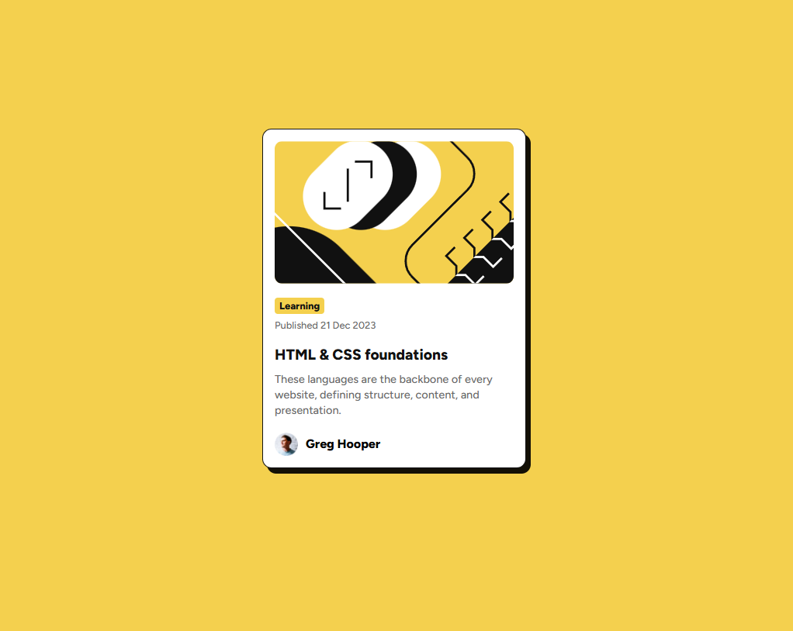

# Frontend Mentor - Blog preview card solution

Esta es mi solución para el reto [Blog preview card challenge de Frontend Mentor](https://www.frontendmentor.io/challenges/blog-preview-card-ckPaj01IcS).

## Tabla de contenidos
- [Descripción general](#descripción-general)
  - [El reto](#el-reto)
  - [Captura de pantalla](#captura-de-pantalla)
  - [Enlaces](#enlaces)
- [Mi proceso](#mi-proceso)
  - [Tecnologías utilizadas](#tecnologías-utilizadas)
  - [Lo que aprendí](#lo-que-aprendí)
- [Autor](#autor)

## Descripción general

### El reto
Los usuarios deben ser capaces de:
- Ver los estados de interacción (hover) en los elementos interactivos (el título del artículo).
- Ver un diseño responsivo que se adapte al tamaño de su pantalla.

### Captura de pantalla
 

### Enlaces
- URL de la solución: [https://github.com/emanuelcantuta/fm-blog-preview-card](https://github.com/emanuelcantuta/fm-blog-preview-card)
- URL del sitio en vivo: [https://emanuelcantuta.github.io/fm-blog-preview-card/](https://emanuelcantuta.github.io/fm-blog-preview-card/)

## Mi proceso

### Tecnologías utilizadas
- HTML5 Semántico
- Propiedades personalizadas de CSS (Variables)
- CSS Flexbox
- Diseño responsivo (Mobile-first)
- Fuentes locales con `@font-face`

### Lo que aprendí
Durante este proyecto reforcé mucho mi conocimiento sobre cómo estructurar correctamente el HTML usando etiquetas semánticas como `<article>`, `<time>` y `<footer>`. 

También aprendí trucos muy útiles de CSS:
1. Cómo usar `@font-face` para cargar tipografías estáticas locales.
2. Cómo aplicar sombras sólidas estilo neo-brutalismo usando `box-shadow` sin difuminado.
3. El uso de `min-height: 100vh` combinado con Flexbox para centrar elementos vertical y horizontalmente en la pantalla.
4. El manejo inteligente de espacios usando la propiedad `gap` dentro de contenedores `flex`.

## Autor
- Frontend Mentor - [@emanuelcantuta](https://www.frontendmentor.io/profile/emanuelcantuta)
- GitHub - [@emanuelcantuta](https://github.com/emanuelcantuta)